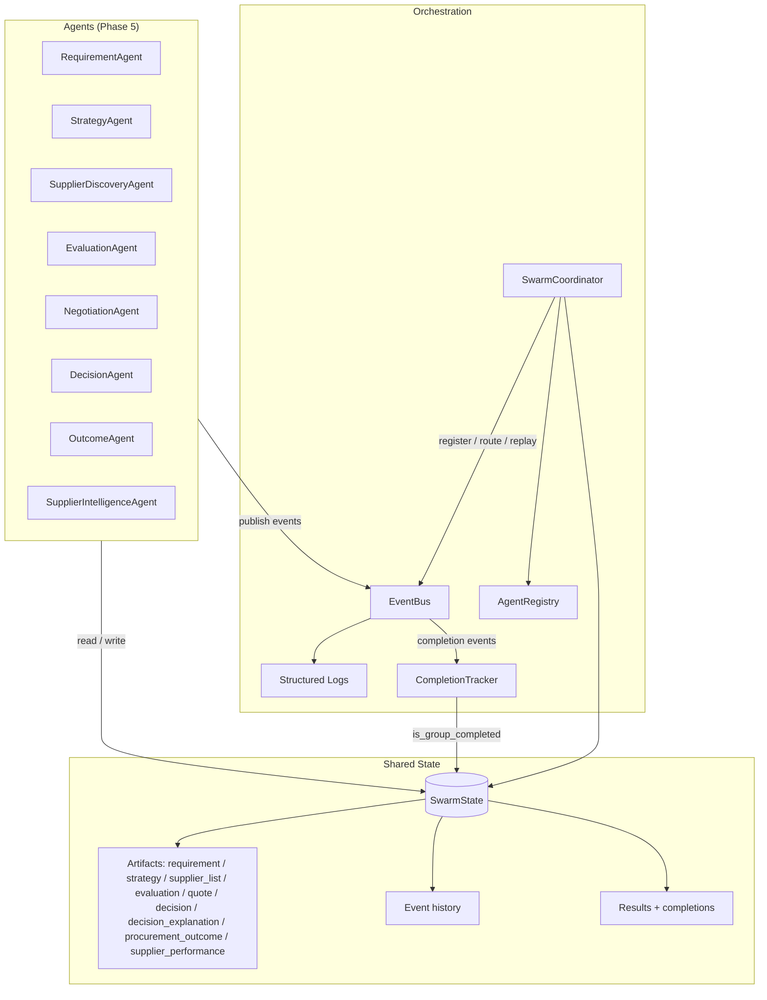
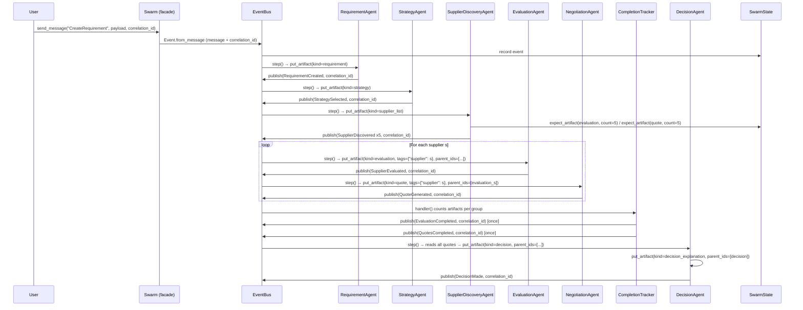

# Swarm Runtime Architecture

The swarm runtime (`swarm/`) is the architectural spine for autonomous
multi-agent procurement. This document describes its layers, the data flow of a
single request, and where it is heading.

> **Status:** Phase 5 — parallel, per-supplier procurement flow with deterministic
> execution strategies and an auditable supplier-intelligence feedback loop on the
> deterministic runtime spine. The runtime is intentionally deterministic — no
> planning, no LLM integration, no autonomous learning — and the domain agents run
> the procurement flow end to end with completion-tracked, parallel per-supplier
> steps. Strategy selection, outcome feedback and supplier memory are explicit,
> seed-based artifacts (no LLM, no embeddings, no vector DB). A planner (and any
> LLM usage) remains explicitly out of scope.

## Layer overview

## Components

| Component | Module | Responsibility |
|-----------|--------|----------------|
| **BaseAgent** | `swarm/core/agent.py` | Abstract agent with `perceive → reason → act` lifecycle, status, a declarative `Capability` schema and a `tags` dict; `step(event)` protocol driven by `drive_on_event` / `route_on_event` |
| **Message** | `swarm/core/message.py` | Sender / receiver / intent / payload / metadata / `correlation_id` |
| **Event + EventBus** | `swarm/core/event.py` | Typed events on an async pub/sub bus; audit log with **replay** |
| **Artifact** | `swarm/core/artifact.py` | Typed, versioned working data produced by agents; supports `tags` for selective queries and `parent_ids` for lineage |
| **SwarmState** | `swarm/core/state.py` | Shared, serializable context over artifacts, events and results; `find_artifacts()` queries by kind / name / tags / `correlation_id`; `expect_artifact` / `complete_artifact` / `get_execution_trace` |
| **CompletionTracker** | `swarm/core/completion.py` | Subscribes to every event, closes a phase once the expected artifact count exists, publishes `EvaluationCompleted` / `QuotesCompleted` (idempotent) |
| **Capability** | `swarm/core/capability.py` | Declarative schema for what an agent can do (name / description / parameters / priority) |
| **AgentRegistry** | `swarm/core/registry.py` | Name-indexed registry with priority-ranked capability discovery and `best_for_capability(capability, **tags)` routing |
| **SwarmCoordinator** | `swarm/orchestration/coordinator.py` | Internal engine: registers agents, routes events, maintains state, seeds `correlation_id` |
| **Swarm** | `swarm/core/__init__.py` | Public facade: start / stop / send / replay / `get_execution_trace` / `expect_artifact` / `complete_artifact`. No business logic |
| **Logging** | `swarm/core/logging.py` | `SWARM_LOG_LEVEL` control (`DEBUG` full event detail, `INFO` lifecycle only) |
| **Wiring** | `swarm/domain/wiring.py` | `build_procurement_swarm(...)` — registers all agents + tracker with the Phase 4 subscriptions and routing |
| **Domain events** | `swarm/domain/events.py` | `ProcurementEventType` (`RequirementCreated`, `StrategySelected`, per-supplier `SupplierDiscovered` / `SupplierEvaluated` / `QuoteGenerated`, completion `EvaluationCompleted` / `QuotesCompleted`, `DecisionMade`) and the `CreateRequirement` intent |
| **Domain artifacts** | `swarm/domain/artifacts.py` | Requirement / strategy / supplier list / evaluation / quote / decision / decision-explanation artifacts with documented data contracts and `parent_ids` lineage |
| **Pricing helpers** | `swarm/domain/pricing.py` | Deterministic floor price, lead time, carbon, bid bond (mirrors `core.agents.supplier` rules) |
| **Domain agents** | `swarm/domain/agents/` | `RequirementAgent`, `StrategyAgent`, `SupplierDiscoveryAgent`, `EvaluationAgent`, `NegotiationAgent`, `DecisionAgent` — pure adapters over the existing `core/` logic |
| **Wiring** | `swarm/domain/wiring.py` | `build_procurement_swarm(..., supplier_memory=...)` — registers all agents + tracker with the Phase 5 subscriptions and strategy-weighted routing; accepts a shared `SupplierMemoryStore` |
| **Supplier memory** | `swarm/memory/supplier.py` | Deterministic, in-memory `SupplierMemoryStore` + module-level `default_store`; `update_from_outcome` maintains running averages, `history_adjustment` maps reliability to a score delta |
| **Strategies** | `swarm/domain/strategy.py` | `Strategy` (price / score / carbon weights summing to 1.0) with `DEFAULT_STRATEGIES` (`cost_optimized`, `balanced`, `low_carbon`) and deterministic `select_strategy(constraints)` |

## Request flow

Every message/event in one logical conversation carries the same
`correlation_id`, so the full exchange can be traced end to end.

## Phase 3: parallel per-supplier flow

The Phase 2 linear pipeline evolved into a parallel, multi-agent flow while
staying fully deterministic and LLM-free:

- **Per-supplier granularity** — `SupplierDiscoveryAgent` announces one
  `SupplierDiscovered` event per supplier; `EvaluationAgent` and
  `NegotiationAgent` run a single dedicated step per supplier
  (`SupplierEvaluated`, `QuoteGenerated`). Suppliers no longer wait on each
  other, and the events are independently traceable.
- **Completion tracking** — the discovery agent declares its expectations with
  `expect_artifact("evaluation", count=5)` / `expect_artifact("quote", count=5)`.
  A `CompletionTracker` subscribed to every event closes a group once the
  expected number of artifacts exists (`is_group_completed`), publishing
  `EvaluationCompleted` then `QuotesCompleted` — exactly once, idempotently.
- **Gate, not broadcast** — `DecisionAgent` subscribes only to
  `QuotesCompleted` and reads all quotes back from shared state, so it cannot
  decide before every supplier has quoted.
- **Capability routing** — `SupplierDiscovered` is delivered through
  `route_on_event(registry.best_for_capability("supplier.evaluate", **tags))`,
  letting a single generalist (or future specialists tagged by region/material)
  win the event without every evaluator reacting to everything.
- **Artifact lineage** — each evaluation artifact lists its requirement
  `parent_ids` and each quote lists its evaluation `parent_ids`, so the
  derivation chain is auditable from `decision` back to `requirement`.
- **Execution trace** — `Swarm.get_execution_trace(correlation_id)` returns an
  ordered `{events, artifacts, agent_actions}` audit trail (agent actions merge
  artifact creation and event publication, excluding runtime-sourced events).
  The `step(event)` protocol — `state` assigned at registration / routing —
  means agents read state without a `step(state, event)` coupling.

## Phase 2 data flow

The domain agents are pure adapters over the existing procurement logic — they
reuse it, they do not reimplement it:

| Domain agent | Reused logic |
|--------------|--------------|
| `RequirementAgent` | `core.protocol.schema.RFQPayload` + the delivery-window / payment-terms defaults from `BuyerOrchestrator.create_rfq`; the market-derived price cap (`spot * 1.2`) from the API layer |
| `SupplierDiscoveryAgent` | `core.market_simulator.MarketSimulator(seed=42)` spot reference + the CostModel supplier templates from `api/main._create_suppliers` |
| `EvaluationAgent` | `core.evaluator.scoring.MultiCriteriaEvaluator` with `configs.settings` weights and ESG baselines |
| `NegotiationAgent` | `swarm.domain.pricing` (same floor-price rule as `core.agents.supplier.SupplierAgent`) |
| `DecisionAgent` | `core.protocol.policy_engine.PolicyEngine` for compliance, then ranks by score and price |

Agents never call each other directly. They only read artifacts from shared
state, produce new artifacts, and announce domain events — so any stage can be
replaced, reordered, or replayed without coupling.

## Hardening guarantees (Phase 1.5)

- **Traceability** — `correlation_id` on both `Message` and `Event`, propagated
  across the message/event boundary and seeded by the coordinator (and by the
  `Swarm` facade's `send_message`).
- **Typed shared state** — arbitrary dict growth replaced by versioned
  `Artifact` objects (who created it, when, and at what version). Artifacts may
  carry `tags` (e.g. `{"supplier": "abc", "region": "EU"}`) and be queried
  selectively via `SwarmState.find_artifacts(kind=..., name=..., tags=...)`.
- **Declarative capabilities** — agents advertise `Capability` schemas with an
  optional `priority`; `by_capability()` returns candidates ranked by priority
  (ties keep registration order) and `best_for_capability()` picks the top one.
- **Replay is read-only** — `EventBus.replay()` (and
  `SwarmCoordinator.replay()`) re-delivers the audit log as `replayed` copies
  that state recorders ignore. Replay is a debugging aid and **never mutates
  canonical state**; use `mode="deliver"` only when rebuilding a fresh runtime.
- **Log level control** — `SWARM_LOG_LEVEL` (default `INFO`) selects the detail:
  `DEBUG` for full event-level logs, `INFO` for lifecycle and high-level routing
  only. Standalone tools call `configure_logging()`; host applications (e.g. the
  FastAPI service) control this through their own structlog config.
- **Role contract** — `Swarm` is the public interface (hold events, agents, and
  state; start / stop / send / replay) and contains no business logic;
  `SwarmCoordinator` is the internal engine and is not called directly by
  external code.
- **Automatic stepping** — registering an agent with a `Swarm` (or
  `SwarmCoordinator`) assigns it the bus and subscribes it via
  `drive_on_event`, so a delivered event runs its whole
  `perceive → reason → act` cycle. Agents therefore never hold a reference to
  the coordinator or to each other.
- **`step(event)` protocol** — agents implement `step(event)` instead of
  `step(state, event=None)`; `BaseAgent.state` is assigned by registration /
  routing / `drive_on_event` / `route_on_event`, and `step` raises
  `RuntimeError` if it was never set. Routing uses `route_on_event(route, state)`
  so a route-selected agent also sees the shared state.
 - **Deterministic domain layer** — the Phase 4 agents are pure, seed-based
   adapters: the market, the supplier pool, the evaluation scores, the quotes and
   strategy selection are all deterministic, so the same `CreateRequirement`
   message always yields the same strategy and the same decision. Domain agents
   skip *replayed* events in `perceive`, so audit-log replay never re-runs the
   flow.

## Phase 4: strategy-based evaluation and auditable decisions

The Phase 3 flow gained two deterministic, LLM-free concerns — what to
optimize, and why a particular supplier won:

- **Execution strategy** — `StrategyAgent` reacts to `RequirementCreated` and
  picks a `Strategy` from the requirement's constraints via the pure
  `select_strategy(constraints)` rule: a hard carbon constraint
  (`max_carbon_per_unit`) selects `low_carbon`; a tight budget (below half of
  `quantity * max_unit_price`) selects `cost_optimized`; otherwise `balanced`.
  The strategy is written as a `StrategyArtifact` (its three weights, which sum to
  1.0) and announced with `StrategySelected`.
- **Strategy-gated discovery** — `SupplierDiscoveryAgent` now subscribes to
  `StrategySelected` rather than `RequirementCreated`, so the supplier pool and
  its completion expectations are only created *after* the strategy artifact
  exists. Because the event bus delivers events concurrently, this gate removes
  the race where evaluation could run before the weights it depends on. In the
  `balanced` strategy the weights reproduce the Phase 3 composite scores
  exactly; when no strategy artifact is present an evaluation falls back to
  `balanced`, so existing score assertions are preserved.
- **Weighted evaluation** — `EvaluationAgent` blends the price, quality and
  carbon sub-scores from the existing `MultiCriteriaEvaluator` with the active
  strategy's weights, recording the strategy used in each `EvaluationArtifact`.
- **Auditable decision reasoning** — `DecisionAgent` produces, alongside the
  `DecisionArtifact`, a `DecisionExplanationArtifact` (`selected_supplier`,
  `strategy_used`, `top_factors`, and a `rejected_suppliers` list with a
  deterministic textual reason for every non-selected supplier derived from the
  policy engine's rejection reason and score/price ordering).

This keeps the runtime deterministic and LLM-free while making *what* is
optimized and *why* it was chosen explicit and traceable through the same
artifact/event lineage.

- **Completion tracking** — `SwarmState.expect_artifact(kind, count=..., correlation_id=...)`
  declares group sizes; `CompletionTracker` (subscribed to every event, ignoring
  replayed ones) closes a group once the expected artifact count exists and
  publishes the completion event exactly once. `complete_artifact` / 
  `is_group_completed` are idempotent and per-`correlation_id`.
- **Execution trace** — `Swarm.get_execution_trace(correlation_id)` is read-only:
  it derives `events`, `artifacts` and a chronological `agent_actions` audit
  trail (artifact creation + event publication per agent, runtime-sourced events
  filtered) from canonical state and never mutates it.

## Phase 5: deterministic supplier intelligence and outcome feedback

Phase 4 answered *what to optimize* and *why a supplier won*. Phase 5 makes the
swarm learn from the outcome **deterministically** — closing the loop from
`DecisionArtifact` → `ProcurementOutcome` → `SupplierPerformance`, without any
LLM and without breaking Phase 4's scores.

- **Outcome capture** — `OutcomeAgent` handles `RecordProcurementOutcome`,
  validates the payload against the remembered decision, and writes an
  `OutcomeArtifact` parented to that `DecisionArtifact.id` (lineage:
  `DecisionArtifact.id` → `OutcomeArtifact.parent_ids` →
  `SupplierPerformanceArtifact.parent_ids`).
- **Supplier memory** — `SupplierIntelligenceAgent` reacts to `OutcomeRecorded`,
  updates the shared `SupplierMemoryStore` via `update_from_outcome(...)`, and
  writes a `SupplierPerformanceArtifact` (running-averages for delivery, quality,
  price-competitiveness and carbon — no free parameters, no embeddings).
- **History-weighted evaluation** — `EvaluationAgent` now accepts a `memory`
  store; after the strategy-weighted composite, it applies
  `history_adjustment(perf)` to the reliability term, clamped to `[0, 1]` and
  rounded to 4dp. When no memory is supplied the adjustment is `0.0`, so the
  Phase 4 balanced scores are reproduced exactly and existing assertions are
  preserved.
- **API + wiring** — `build_procurement_swarm(..., supplier_memory=...)` shares a
  module-level `default_store` across requests; `POST /swarm/{request_id}/outcome`
  and `GET /swarm/supplier/{supplier_id}/performance` expose the feedback loop,
  and replay skips `RecordProcurementOutcome` so re-runs stay deterministic.

Determinism caveat: the metrics are running means, so they are deterministic
given the order of recorded outcomes; only `last_updated` timestamps vary with
wall-clock time and tests avoid asserting timestamp equality.

## Outlook

Phase 5 is complete: an end-to-end deterministic procurement swarm with parallel,
per-supplier steps, strategy-gated evaluation, auditable decision reasoning, and a
supplier-intelligence feedback loop on the runtime spine. What is deliberately
left for later:

- **Live integration** — replace the seeded `MarketSimulator` reference with the
  live market feed and wire `DecisionMade` into the ledger / API, so the swarm
  becomes the auction engine's orchestration path. The read-only swarm trace
  endpoints in `api/main.py` already expose dispatch (`POST /swarm/requirements`)
  and trace reads (`GET /swarm/trace/{request_id}`, `/completions`,
  `/swarm/state/{request_id}`).
- **Planning** — an explicit planner (task decomposition, capability routing via
  `best_for_capability()`) that assembles the agent chain from intent rather than
  a hard-coded registration order; specialist evaluators tagged by region or
  material would then be selected by `route_on_event`.
- **Robustness** — retries, sagas/compensation for failed stages, and durable
  event sourcing in place of the in-memory audit log.
- **LLM integration** — remains explicitly out of scope by design; the runtime
  is built so a single, guarded adapter could replace one deterministic stage
  later without touching the bus or state model.
